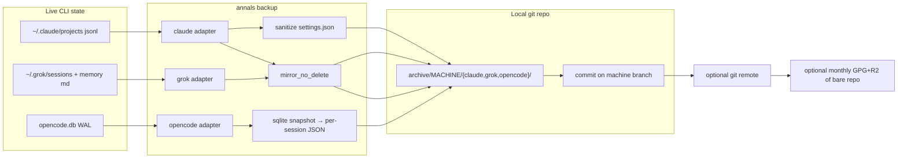
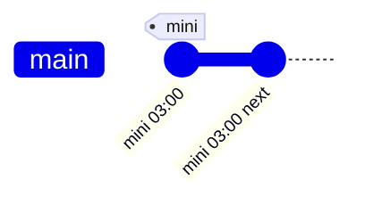

# annals specification

| | |
|---|---|
| Status | v1, implementable |
| Date | 2026-09-08 |
| License | MIT |
| Runtime | Python ≥ 3.12, stdlib only, Unix (macOS / Linux) |

This document is the contract. `README.md` is the landing page. If they disagree, this file wins.

---

## 1. Overview

Coding-agent CLIs persist conversations on the local disk so they can resume. They also treat that persistence as **cache**: Claude Code prunes jsonl transcripts, OpenCode keeps a live WAL database, Grok rebuilds a large search index next to a small markdown memory store. Users who actually want history — debugging a past decision, recovering a deleted session, moving machines without losing the record — need a different object.

**annals** is an unattended harvester. On a schedule it copies whatever each adapter knows how to read into a local git repository, **never deleting destination files the source no longer has**, then optionally pushes to a git remote the user owns. Cloudflare R2 (or any S3) is an optional monthly snapshot of that already-compressed git object store, not the daily path.

One-line positioning:

> Agent CLIs treat chat history as cache. Annals treats it as an append-only git archive.

---

## 2. Background and motivation

Production use on a 24/7 Mac mini (daily 03:00 launchd, dual-machine with a MacBook at 13:00, VPS git remote, monthly GPG+R2 of the bare repo) produced four facts that are now invariants:

1. **The source deletes.** Claude Code removes jsonl under `~/.claude/projects/` as part of normal cleanup. `rsync --delete` or a bidirectional “session sync” tool will discard the only remaining copy. GitHub issue patterns such as “chat JSONLs deleted from `~/.claude/projects/` despite `cleanupPeriodDays`” are the user-visible form of this.
2. **Storage shape is not uniform.** Jsonl and markdown are git-friendly. A WAL SQLite file is not: a 29 MB `opencode.db` that changes daily becomes ~14 GB/year/machine of git history if stored as a blob. Splitting into one JSON file per session dropped a typical day to tens of kilobytes of new delta.
3. **Most of the bytes are rebuildable.** Grok `~/.grok/memory/index.sqlite*` measured ~46.5 MB vs ~161 KB of actual markdown memory (~99%). Archiving the index is a storage bug.
4. **Hosts do not merge.** Claude encodes the project path into the directory name (`%2FUsers%2F…`). Session ids are local. Two machines writing one working tree, or merging `master` with `mini-master`, produces collisions and a resume story that does not work. Independent branches (and independent subdirectories) do.

Adjacent tools do adjacent jobs and are out of scope:

| Tool | Job | Not this |
|---|---|---|
| [agent-sessions](https://github.com/jazzyalex/agent-sessions) | Browse / search / resume on one Mac | Reader, not archive |
| [agent-sessions-sync](https://github.com/Gregor-von-Vitek/agent-sessions-sync) | Bidirectional sync so you can resume on another machine | Syncs deletions; GitHub+VS Code specific |
| [claude-code-backup-guide](https://github.com/jtklinger/claude-code-backup-guide) | Backup `~/.claude` *config* | Environment, not conversations |
| `claude export`, OpenCode sqlite CLIs | One-shot export of one vendor | Not unattended, not multi-agent, not anti-delete |

---

## 3. Goals and non-goals

### Goals (v1)

- Unattended harvest of Claude Code, Grok, and OpenCode session history on macOS and Linux.
- Append-only destination: source deletion never removes archive files.
- Git as the archive medium, with per-session / per-file text so deltas stay small.
- Config-driven paths, machine id, branch, and optional remote. No hardcoded personal topology.
- Best-effort sanitization of **settings** files. Honest documentation that transcript bodies contain secrets.
- Adapter failures are isolated: one source dying does not skip the others; local commit is a successful backup even if push fails.
- Installable as `uv tool install` with **zero runtime dependencies**.

### Non-goals (v1)

- GUI, TUI, web app, VS Code extension, SaaS.
- Cross-host **resume** (path remapping so `claude --resume` sees the other laptop’s sessions).
- Windows.
- Codex, Gemini CLI, Cursor, Copilot CLI adapters (detected by `scan`, not harvested).
- Redacting secrets inside transcript bodies.
- Backing up memos, CouchDB, dotfiles, skills, agents, hooks, or auth stores.
- 42plugin database rescue (contrib script under `extras/`, schema is private).
- Encryption of the daily git archive (the optional monthly recipe encrypts a tar of the *bare* repo).

---

## 4. Invariants

These are tested. A change that violates one is a bug, not a feature.

| ID | Invariant | Test |
|---|---|---|
| I1 | Source deletion ≠ archive deletion. `mirror_no_delete` never unlinks destination files. | `tests/test_mirror.py::test_no_delete_keeps_dest_only_files`, `tests/test_claude.py` |
| I2 | Binary SQLite does not enter git. OpenCode is snapshotted then split into one JSON per session. | `tests/test_opencode.py` |
| I3 | Rebuildable indexes are excluded (`index.sqlite*`, `.dream-lock`). | `tests/test_mirror.py::test_exclude_rebuildable_index` |
| I4 | One machine → one archive subdirectory. Recommended: one git branch. Working trees are not merged. | config schema: `archive.machine`, `archive.branch` |

Additional operational rules, not numbered tests:

- Push is **not** required for the backup to have succeeded. Exit 0 if the local commit (or “nothing to commit”) succeeded.
- Overlapping runs skip (exclusive lock, exit 0).
- Unreadable source files are logged and skipped; the run continues.

---

## 5. Architecture



Daily path: adapters → local git. The local repo is the product; it is what defeats source-side deletion, which is the failure users actually hit.

Everything to the right of it is optional and serves a *different* failure. The git remote's primary job is **topology** — letting two machines converge into one repo on separate branches — and it is only incidentally offsite redundancy. Whole-disk loss is better covered by the user's existing system backup (Time Machine, Backblaze, restic, borg), which already sweeps `~` and handles a git repo well: ordinary files, self-verifying, cheaply snapshotted. Annals does not reinvent that layer; it produces something that layer already protects. R2 is a second copy of the *remote's* object store, typically run on the machine that already holds the bare repo (a VPS next to R2, not a residential uplink).

Corollary for docs and defaults: `push` defaults to false, and a single-machine user needs no remote at all.

### Process

1. Load config (`--config`, else `$ANNALS_CONFIG`, else `~/.config/annals/config.toml`).
2. Take `<state_dir>/annals.lock` (fcntl, non-blocking). If busy: log and exit 0.
3. Ensure the archive repo exists and has a usable git identity. A missing identity fails here, **before** any harvest — otherwise the harvest writes the whole archive and only then discovers it cannot commit.
4. For each enabled `[[source]]`, call the adapter with destination `archive/machine/kind/`. Adapter errors are logged; other sources still run.
5. If every enabled source failed: exit 1.
6. `git add -A` and commit if the index is dirty. Message: `annals backup [MACHINE] YYYY-MM-DD HH:MM:SS — N files changed`.
7. If `archive.remote` is set and `push` is true: `git push` with `GIT_SSH_COMMAND` disabling ControlMaster (reused multiplexed SSH dies mid-push on large packs: “Broken pipe”). Push failure is logged, exit remains 0.
8. Append the same lines to `<state_dir>/annals.log` and stdout.

### Operational state is not archive data

The lock (a pid, rewritten every run) and the log (appended every run) are **operational state, not harvested data**. They live in `state_dir`, which defaults to `$XDG_STATE_HOME/annals/<machine>` (else `~/.local/state/annals/<machine>`) and must not be inside the archive repo — config load rejects that.

Kept inside the worktree they were swept up by `git add -A`, so *every* run produced a commit even when no session had changed, and step 6's "commit only if dirty" branch was unreachable. A daily timer then generated a commit a day of pure noise.

### Package layout

```
src/annals/
  cli.py            init / scan / backup / status
  config.py         TOML schema
  mirror.py         I1 primitive
  sanitize.py       settings scrubber
  sqliteutil.py     WAL-safe snapshot
  gitstore.py       init / commit / push
  lock.py           exclusive lock
  scan.py           discovery
  adapters/
    claude.py
    grok.py
    opencode.py
extras/42plugin_rescue.py    contrib, not imported
recipes/                     launchd, systemd, r2-monthly.sh
examples/config.toml
```

New agents are a new module plus a `kind` string. `cli.py` does not grow per-vendor branches.

---

## 6. CLI

```
annals [--config PATH] [--version] <command>
```

| Command | Behaviour | Exit |
|---|---|---|
| `init [--machine NAME] [--archive DIR] [--branch B] [--remote URL] [--force]` | Scan default paths, write config | 0; 2 if config exists without `--force` |
| `scan` | Print each known agent: present / missing / unsupported | 0; works without config (uses defaults) |
| `backup [--dry-run] [--no-push]` | Harvest + commit + optional push | 0 success or lock skip; 1 hard failure; 2 bad config |
| `status` | Config path, archive path, machine, branch, remote, HEAD, `du -sh` | 0; 2 bad config |

`--dry-run` prints the scan and writes nothing.

`init` defaults: machine = first label of `socket.gethostname()`, archive = `~/annals-archive`, branch = machine, each v1 source `enabled` iff its default path exists.

---

## 7. Configuration

TOML. No YAML, no JSON, no implicit env except `ANNALS_CONFIG`.

```toml
[archive]
path = "~/annals-archive"   # required
machine = "mini"                 # required, non-empty; becomes subdirectory name
branch = "mini"                  # default: machine
remote = "git@github.com:YOU/annals-archive.git"  # optional
remote_name = "origin"           # default origin
push = true                      # ignored if remote is unset
# Lock + log location. Default $XDG_STATE_HOME/annals/<machine>,
# else ~/.local/state/annals/<machine>. Must be outside `path`.
state_dir = "~/.local/state/annals/mini"  # optional

[git]
author_name = "annals"      # optional; else inherit git config
author_email = "you@example.com" # required somehow: config or global git
pack_window_memory = "64m"
pack_size_limit = "256m"

[[source]]
kind = "claude"                  # claude | grok | opencode
enabled = true
root = "~/.claude"               # optional override
```

Rules:

- Unknown `kind` is a config error (v1 does not silently skip Codex).
- Duplicate `kind` is a config error.
- At least one `[[source]]` is required.
- `root` for OpenCode is the **database file**, not the parent directory.
- `path` and `root` go through `expanduser` + `resolve`.
- If `user.email` is unset both in `[git]` and in the repo/global git config, `backup` fails before committing. Anonymous commits are worse than a loud error.

Default roots:

| kind | default `root` |
|---|---|
| claude | `~/.claude` |
| grok | `~/.grok` |
| opencode | `~/.local/share/opencode/opencode.db` |

`scan` also looks at, but does not harvest:

| kind | path |
|---|---|
| codex | `~/.codex/sessions` |
| gemini | `~/.gemini` |
| cursor | `~/.cursor` |

---

## 8. Archive layout

```
<archive>/                          # git root — harvested data only
  .git/
  <machine>/
    claude/
      projects/…                    # mirror of ~/.claude/projects
      CLAUDE.md                     # if present
      rules/                        # if present
      settings.sanitized.json       # never the live settings.json
    grok/
      sessions/…
      memory/…                      # markdown; no index.sqlite*
      config.toml
    opencode/
      YYYY-MM/
        <session-id>.json
```

This unifies a production layout that had historically split `opencode/<machine>` at the repo root from `<machine>/claude`. v1 is consistent: everything hangs off `<machine>/`.

Multi-machine in **one** git repo:

```
archive/
  macbook/…
  mini/…
```

with branches `macbook` and `mini` (or `master` / `mini-master` — the name is the user’s). Histories stay linear and unmerged. Checkout of one branch on a given host is enough; the other machine’s tree is not required at runtime.

`.gitignore` is not written by annals. The archive is the data; it should contain what was harvested — and because lock and log now live in `state_dir`, there is nothing in the worktree to ignore. The *software* repo (this project) gitignores build artifacts, not transcripts — because this project must never contain transcripts.

Operational state sits outside the repo:

```
$XDG_STATE_HOME/annals/<machine>/   # default ~/.local/state/…
  annals.lock
  annals.log
```

---

## 9. Adapters

Each adapter implements:

```python
class Adapter(Protocol):
    kind: str
    def detect(self, src: SourceConfig) -> Detected: ...
    def harvest(self, src: SourceConfig, dest: Path, log) -> HarvestResult: ...
```

`dest` is `archive/machine/kind`. Missing live data is a skip (`ok=True`), not a failure. A missing source on a machine that simply does not run that CLI is normal.

### 9.1 Claude Code

Live tree: `root` = `~/.claude`.

| Take | How |
|---|---|
| `projects/` | `mirror_no_delete`, exclude `.DS_Store` and `*.lock` |
| `CLAUDE.md` | copy if present |
| `rules/` | `mirror_no_delete` if present |
| `settings.json` | sanitize → `settings.sanitized.json`; rewrite only when canonical JSON changes |

Leave behind: `skills/`, `agents/`, `hooks/`, `commands/`, `backups/`, any `auth` file, `.credentials`. Those are environment and a secret surface. Project-level auto-memory that already lives under `projects/<proj>/memory/` is included by the `projects/` mirror.

Sanitize rules (see §11): key-name match **and** value-shape match. Sort keys, stable indent, trailing newline, skip write if identical — so git does not see a daily mtime bump.

### 9.2 Grok

Live tree: `root` = `~/.grok`.

| Take | How |
|---|---|
| `sessions/` | `mirror_no_delete` |
| `memory/` | `mirror_no_delete`, exclude `index.sqlite*`, `.dream-lock`, `.DS_Store`, `*.lock` |
| `config.toml` | copy as-is (`env_key` is a variable *name*) |
| `settings.json` if present | same sanitizer as Claude |

Never copy `auth.json` or `auth.json.lock`. If they appear under `dest` (manual copy, future layout change), delete them from the archive during harvest and log it. This is the one allowed destination delete, and it is only for credential filenames.

### 9.3 OpenCode

Live data: `root` = `opencode.db` (default `~/.local/share/opencode/opencode.db`). Nested `snapshot/` git repos used for code rollback are not read.

Algorithm:

1. Take a consistent snapshot of the live DB (see §10).
2. `SELECT * FROM session ORDER BY time_created`.
3. For each session id, load `message` and `part` rows ordered by `time_created`.
4. Month directory from `time_created` milliseconds since epoch (`YYYY-MM`; `unknown/` if unparseable).
5. Write `{session, messages, parts}` as JSON: `ensure_ascii=False`, `indent=1`, `sort_keys=True`. Bytes fields decode as UTF-8 with replacement.
6. If the file already exists and matches byte-for-byte, do not write (mtime stability).

Schema drift (missing `session` table, etc.) is an adapter failure (`ok=False`), logged, not a process abort.

Idempotence is required: a second harvest with no session changes must produce `wrote=0`.

---

## 10. SQLite snapshot

Production OpenCode harvest failed for weeks with `sqlite3.OperationalError: unable to open database file` when opening `file:{path}?mode=ro`. v1 must not ship that failure mode.

`sqliteutil.snapshot_connection` tries, in order:

1. Direct `sqlite3.connect(path)` with `busy_timeout=30000`, then `Connection.backup()`.
2. URI `Path.resolve().as_uri() + "?mode=ro"` (`file:///abs/path?mode=ro`, not `file:/abs/...`).
3. Copy `db` + `db-wal` + `db-shm` to a temp dir and open the copy. This can theoretically tear if a writer checkpoints mid-copy; the next successful harvest rewrites any session file whose canonical JSON later stabilizes. Preferable to skipping OpenCode entirely.

Always go through the backup API so uncheckpointed WAL frames are included. Always yield a read-only connection to the snapshot, never to the live file, to the exporter. Temp dirs are deleted in `finally`.

---

## 11. Security and privacy

### Threat model

The archive is a **private** store of everything the user typed to an agent, including tool output. Typical contents: API keys in shell transcripts, `.env` dumps, customer data, internal URLs. Assuming “it is only my laptop” is how copies leak onto GitHub.

annals does **not** claim to make a public-safe archive.

### What is scrubbed

`sanitize.scrub` walks JSON-shaped objects:

- If a **key** matches `(token|secret|password|api[_-]?key|credential)` (case-insensitive) and the value is a string longer than 8 characters → replace the value with `<REDACTED>`.
- Regardless of key, **values** matching Bearer tokens, `gh[pousr]_`, `sk-`, `dapi`, `AKIA`/`ASIA`, Slack `xox[baprs]-`, Google `AIza` are substituted.

Rationale: a production `settings.json` carried a Jellyfish Bearer token in `OTEL_EXPORTER_OTLP_HEADERS`. Key-name matching would have missed it.

The key remains, so the archive still shows that a credential *was configured*.

### What is not scrubbed

- Transcript jsonl / JSON / markdown bodies.
- Grok `config.toml` (keys are names).
- OpenCode session JSON.

Document this in the README. Recommend: private git remote, no public fork of an archive, disk encryption.

### What is never copied

- `auth.json` and `*.lock`.
- GPG passphrases, R2 keys, AWS credentials — those belong to recipes, not to annals.

### Git remote

Default remote is unset. If the user sets a GitHub URL, it is their repository. annals never creates a GitHub repo, never uses a GitHub App, never phones home.

SSH push disables ControlMaster (see §5). That is reliability, not security.

### Monthly R2 recipe

`recipes/r2-monthly.sh` encrypts with GPG AES256 **before** upload. Plaintext never leaves the machine that runs the recipe. The passphrase file is `chmod 600`. The recipe is not invoked by `annals backup`.

---

## 12. Git topology



A second machine uses a second branch in the same bare repo:

```
mini-master   ●──●──●──●
master        ●──●──●     (other host; never merged)
```

Rationale versus “everyone pushes `main`”:

- Path encodings differ across hosts (`/Users/…` vs `/home/…` vs `C:\…`).
- The same session id will not exist on both machines; a merge does not produce a useful working tree.
- Resume tools look up by local path. Merging does not make `--resume` work, and it can overwrite live jsonl.

`git init -b <branch>` on first backup. `pack.windowMemory` and `pack.packSizeLimit` are set so a 3 GB VPS receiving the push does not OOM.

Identity: `[git].author_*` if set, else existing git config. No hardcoded personal name in the tool.

---

## 13. Scheduling recipes

Not part of the library. Copied and edited by the user.

| File | Role |
|---|---|
| `recipes/launchd.plist` | macOS, `StartCalendarInterval` 03:00, stdout/err under the archive |
| `recipes/annals.service` + `.timer` | systemd user, oneshot, `Nice=15`, idle IO, `OnCalendar=*-*-* 03:00` |
| `recipes/r2-monthly.sh` | monthly tar.gz of a **bare** repo, GPG, S3/R2, keep last `KEEP` (default 3) |

Stagger dual-machine hosts (e.g. 03:00 and 13:00) so they do not push the same remote at once. Independent branches make this a courtesy, not a correctness requirement.

The R2 recipe must run near the object store for full restore tests. A 1 GB `aws s3 cp` over a residential link has been observed to stall past 40 minutes. Verification on the laptop is `head-object` plus the first 100 bytes: GPG symmetric AES256 ciphertext starts with packet tag `0x8c`.

---

## 14. Contrib: 42plugin rescue

`extras/42plugin_rescue.py` reads `~/.42plugin/plugin.db` tables `conversation_sessions` / `conversation_messages` and writes markdown for session ids that are **not** in the archive’s `claude/projects/**/*.jsonl`.

`--projects` must be the **archive** tree, not the live `~/.claude/projects`. Because of I1 the archive is a superset; “not in the archive” is the true missing set. Pointing at the live tree would re-rescue sessions Claude still has on disk but that have not been harvested yet, and miss ones already pruned.

This script is not imported by the package. 42plugin’s schema is not a public API. When it breaks, it does not break v1.

---

## 15. Observability

- Every harvest line is printed and appended to `archive/annals.log`.
- Per-adapter counts: `copied`, `skipped`, `errors`.
- Git: skip / commit sha + file count / push ok or push error.
- Final `du -sh` of the archive.
- No metrics daemon, no notifications. A wrapper can grep the log or watch launchd/systemd status.

`status` is the human check: HEAD, size, remote.

---

## 16. Error handling and exit codes

| Code | Meaning |
|---|---|
| 0 | Success, nothing to commit, lock skip, or push failed after a good local commit |
| 1 | Could not write the archive, git identity missing, or every enabled source failed |
| 2 | Config missing or invalid |
| 130 | SIGINT |

Adapter-level: exceptions become `HarvestResult(ok=False)` and the rest of the run continues.

`mirror_no_delete` catches `OSError` per file (`--ignore-errors` equivalent).

---

## 17. Testing

Runtime has no pytest dependency. Dev: `uv run pytest`.

Minimum coverage (ship-blocking):

- I1 / I2 / I3 as in §4.
- Sanitize: OTEL header Bearer, `api_token` key, GitHub PAT, short non-secret strings, structure preserved.
- OpenCode: export splits sessions, second run is a no-op, WAL rows appear in the snapshot.
- Config: unknown kind, duplicates, TOML round-trip.
- Gitstore: dirty tree commits; second run does not.

No test may read the developer’s real `~/.claude` or write into `~/claude-backups`.

---

## 18. Compatibility

| | |
|---|---|
| OS | macOS, Linux. `fcntl` lock. Windows is a hard error at import of `lock.py`. |
| Python | 3.12+ (`tomllib`, type syntax). |
| Git | Required on `PATH` for `backup` / `status`. |
| Disk | Archive is typically 1–3 GB after months of mixed CLI use; git packs smaller than the working tree. |
| Agents | Claude / Grok / OpenCode as they exist in 2026. Adapter code is allowed to be boring and strict; schema drift fails that adapter, not the process. |

---

## 19. Alternatives considered

| Alternative | Why not |
|---|---|
| Publish the existing `~/claude-backups` git repo | It contains real conversations. History cannot be scrubbed confidently. New empty repo is mandatory. |
| Bidirectional sync (the VS Code extension model) | Conflicts with I1; resume-across-hosts is a different product and needs path mapping. |
| Whole-home Time Machine / iCloud of `~/.claude` | Time Machine *does* delete when the source deletes, if the retention window has passed. Also copies auth files. |
| Check `opencode.db` into git | I2; measured cost. |
| Merge memos/CouchDB R2 snapshots into this tool | Different object (encrypted full snapshots, 10 GB free-tier math, Docker). Separate script, separate schedule. |
| Rust rewrite | The production tool is bash + three stdlib Python files. A rewrite adds nothing to I1–I4 and raises the install bar. |
| SaaS / hosted collector | The data is the user’s most sensitive local corpus. No third-party store. |
| Redact transcript bodies in v1 | High false-positive cost, still not a security boundary, delays shipping the archive people actually need. Document the risk instead. |

---

## 20. Rollout

1. This repository, empty of any transcript data.
2. Operator runs `annals init` on a machine that already has a hand-rolled harvester, points `archive.path` at a **new** directory, runs `backup` in parallel with the old job for several days, compares file counts.
3. Switch launchd/cron to `annals backup`. Keep the old script until two successful scheduled runs.
4. Only then point `archive.remote` at the existing VPS bare repo (new branch or same branch after a one-time import — operator’s choice; the tool does not migrate).
5. Public GitHub (software only) + optional article. Hook is “the CLI deletes your history”, not “backup to R2”.

Rollback: the old bash harvester and the new CLI write different archive paths during soak; turning launchd back is a plist edit.

---

## 21. Key decisions

1. **Append-only mirror, not sync.** The adversary is the vendor’s cache eviction, not disk loss alone. Destination deletes are forbidden except for known credential filenames under the Grok dest.
2. **Git is the daily store; object storage is monthly and optional.** Jsonl/JSON/markdown delta-compress. A 1 GB encrypted blob every night would blow a 10 GB free tier and destroy the “what changed today” record.
3. **Per-machine branches and directories, never merge.** Resume is not the job; collisions are real.
4. **Stdlib Python CLI, not an app.** Install with `uv tool`. Zero runtime deps. Matches the production scripts this was extracted from.
5. **Sanitize settings, not transcripts.** Keep the honest warning. A fake redaction pass would be worse than none.
6. **OpenCode is exported, not copied.** Snapshot API + one file per session + content-stable writes.
7. **Push failure is not backup failure.** Local git is complete. The remote is a second copy.
8. **42plugin rescue is contrib.** Useful, schema-private, must not gate v1.
9. **Do not open-source the live archive.** New repo, empty history.
10. **Fix the SQLite open failure before calling this shipped.** Three-step snapshot in `sqliteutil.py`.

---

## 22. Open questions

None that block v1. Deferred, not undecided:

- Codex / Gemini / Cursor adapters: add when someone using those tools runs `scan` and files an issue. Detection paths are already listed.
- Transcript-body redaction as an opt-in filter.
- `annals restore` / export-to-markdown. Out of v1; git itself is the restore tool (`git checkout`, copy files back).
- Windows. No current operator.

---

## 23. Future work (PR-sized)

These are not required to publish v1.

| PR | Scope | Depends on |
|---|---|---|
| Codex adapter | `~/.codex/sessions` mirror_no_delete, same machine layout | v1 |
| Gemini adapter | whatever the current on-disk format is; verify before copying a whole `~/.gemini` (oauth files) | v1 |
| Cursor adapter | `~/.cursor` is mixed IDE state — must exclude credentials explicitly | v1 |
| `annals verify` | fsck, sample OpenCode JSON parse, count jsonl vs last run | v1 |
| Opt-in body redaction | reuse `sanitize.VALUE_PATTERNS` on jsonl lines, off by default | v1 |
| Homebrew / mise packaging | after a tagged release | public remote |

---

## 24. References

- Production harvester this spec was extracted from: `~/claude-backups/backup.sh`, `export-opencode.py`, `sanitize-settings.py` on the operator’s Mac mini (private; not in this repo).
- Monthly bare-repo archive: `backup-claude-git.sh` on the operator’s VPS (private); public form is `recipes/r2-monthly.sh`.
- Design notes: `Sources/digests/chat-summary/encrypted-r2-backup-layer-buildout.md` in the operator’s vault (private).
- Claude Code session location: `~/.claude/projects/` (vendor docs, “Manage sessions”).
- Prior art: agent-sessions, agent-sessions-sync, claude-code-backup-guide (see §2).
